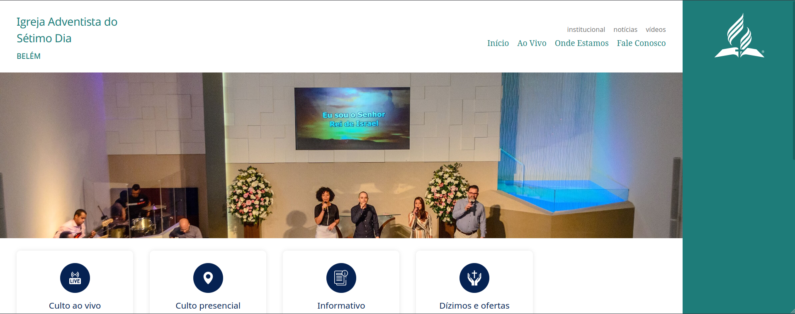
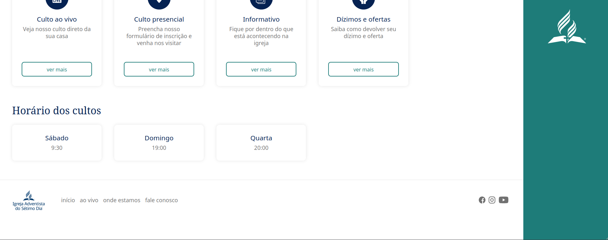

# Minhas IASD

**Minha IASD** é o projeto para que você tenha o site de sua igreja de forma fácil.

## Sumário

- [Requisitos](#requisitos)
- [Instalação](#instalação)
- [Executando o projeto](#executando-o-projeto)
- [Páginas do projeto](#páginas-do-projeto)
- [Parâmetros](#parâmetros)
- [Como contribuir](#como-contribuir)
- [Imagens](#imagens)

## Requisitos

- Node 12.18.2
- NPM 6.14.5

## Instalação

Execute o comando abaixo no terminal:
```bash
npm install
```

## Executando o projeto

Execute o comando abaixo no terminal:
```bash
npm start
```

## Páginas do projeto

- Home
  - Links para culto ao vivo, culto presencial, informativo e dízimos e ofertas
  - Horário dos cultos
- Culto ao vivo
  - Transmissão via Youtube
- Onde estamos
  - Endereço e google maps
- Fale conosco
  - Whatsapp e telefone
  - Formulário ed contato
- Informativo pelo Whatsapp
  - Texto com número do whatsapp para recebê-lo
- Dízimos e ofertas
  - Informações bancárias da igreja

## Parâmetros
Parâmetros presentes no arquivo `.env.example` - que deve ser renomeado para `.env` para fazer testes neste projeto - para dinamizar informações do site.

- `YOUTUBE_LIVE_EMBED_CODE`: Código para colocar o embed do Youtube no site.
- `YOUTUBE_CHANNEL`: ID do canal no Youtube.
- `FACEBOOK_PAGE`: ID da página do Facebook.
- `INSTAGRAM_PROFILE`: ID do perfil do Instagram.
- `FACE_TO_FACE_WORKSHIP_REGISTER_URL`: URL para cadastro do culto presencial.
- `CHURCH_ADDRESS`: Endereço da igreja.
- `CHURCH_TELEPHONE`: Telefone de contato da igreja.
- `CHURCH_EMAIL`: E-mail de contato da igreja.
- `CONTACT_FORM_FORMSPREE_ID`: ID do serviço Formspree para receber os dados do formulário e enviar o email.
- `CHURCH_GOOGLE_MAPS_PLACE_ID`: ID do Google Maps para mostrar o lugar.
- `CHURCH_GOOGLE_MAPS_API_KEY`: API key do Google Maps.
- `CHURCH_NAME`: Nome da igreja.
- `TITHE_BANK_NAME`: Nome do banco(e código) para o depósito dos dízimos e ofertas.
- `TITHE_BANK_AGENCY`: Agência para o depósito dos dízimos e ofertas.
- `TITHE_BANK_ACCOUNT`: Número da conta para o depósito dos dízimos e ofertas.
- `TITHE_BANK_DOCUMENT_NUMBER`: CNPJ da igreja para o depósito dos dízimos e ofertas.
- `TITHE_EMAIL`: Email para enviar comprovante do dízimo ou oferta.
- `TITHE_WHATSAPP`: Whatsapp para enviar comprovante do dízimo ou oferta.
- `INFORMATIVE_ACTIVE`: Será mostrado a caixa para se cadastrar no informativo pelo Whatsapp? Se sim, `true`, se não, remova-o.
- `INFORMATIVE_WHATSAPP`: Telefone do Whatsapp para enviar a mensagem e começar a receber o informativo.
- `CULT_SATURDAY_TIME`: Horário do culto de sábado.
- `CULT_SUNDAY_TIME`: Horário do culto de quarta.
- `CULT_WEDNESDAY_TIME`: Horário do culto de domingo.

Para mudar a imagem que fica no meio das páginas, substitua a imagem `src/assets/images/home_background.jpeg`.


## Como contribuir

1. Crie um fork deste projeto.
1. Faça suas mudanças e crie os testes.
1. Crie um pull request com uma boa descrição do que está sendo feito.

## Imagens



